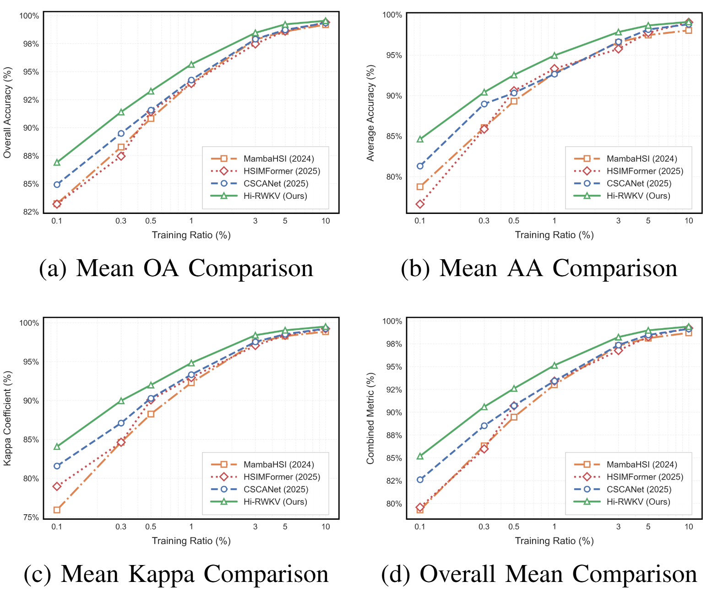

# Hi-RWKV: Hierarchical RWKV Modeling for Hyperspectral Image Classification

This repository contains the experimental results and supplementary materials for the paper:

**Hi-RWKV: Hierarchical RWKV Modeling for Hyperspectral Image Classification**  
*Submitted to IEEE Transactions on Image Processing*

[Paper PDF](./IEEE_Transactions_on_Image_Processing___HISV.pdf) | [Project Page](https://github.com/HSI-Lab/Hi-RWKV)

---

## 🚀 Highlights
- **Novel Architecture**: First hierarchical encoder integrating bidirectional RWKV for dense pixel-wise hyperspectral recognition.
- **Linear-Complexity Global Modeling**: Achieves spectral–spatial dependency modeling with *O(N)* complexity.
- **Shift-Based Spatial Mixing**: Captures omnidirectional spatial relationships efficiently.
- **Progressive Resolution Reduction**: Maintains discriminative features while reducing memory cost.
- **State-of-the-Art Performance**: Consistent improvements over CNN-, Transformer-, and Mamba-based baselines on four benchmarks.

  
*Fig. 2: Overall architecture and key components.*

---

## 📊 Experimental Results

We evaluate Hi-RWKV on **Indian Pines**, **XuZhou**, **HongHu**, and **HanChuan** datasets.  
Hi-RWKV consistently achieves **higher OA, AA, and Kappa** than SOTA baselines, especially in low-data regimes (0.01%-1%).

  
*Fig. 1: Comparative classification performance under different training ratios.*

---

## 📢 Important Notice
> **Currently, only the experimental results reported in the paper are publicly available.  
> The complete training and testing code will be released after the paper is officially accepted.**

---

## 📚 Citation
If you find this work useful, please cite:
```bibtex
@article{HiRWKV2025,
  title={Hi-RWKV: Hierarchical RWKV Modeling for Hyperspectral Image Classification},
  author={...},
  journal={...},
  year={2025}
}
