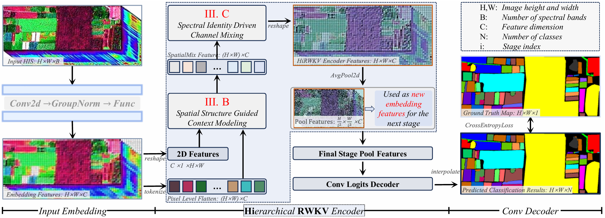
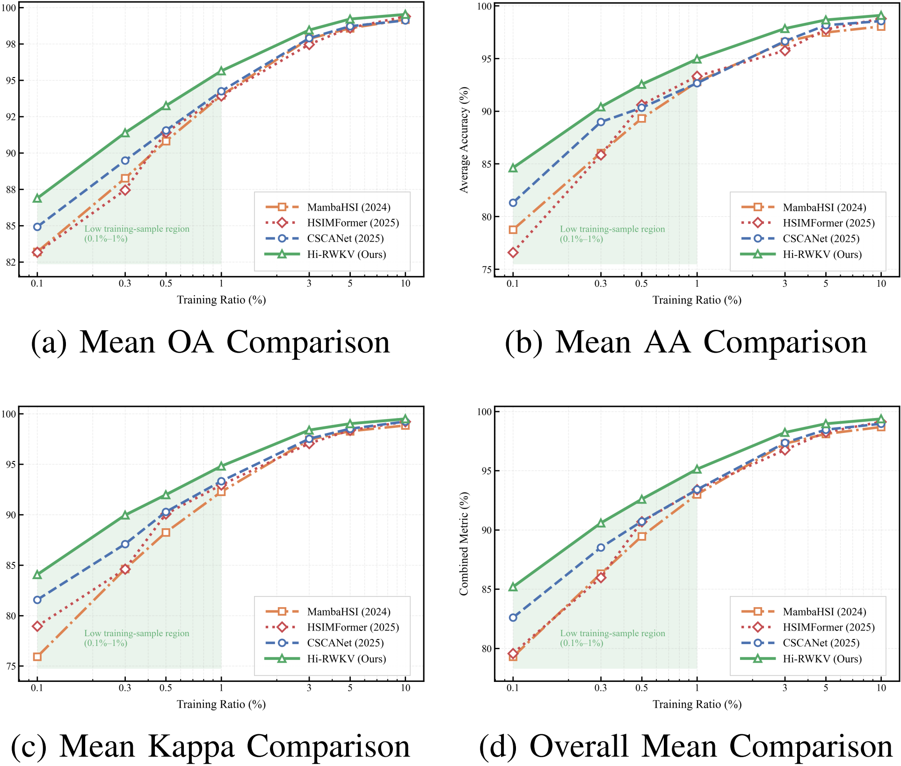

# Hi-RWKV: Hierarchical RWKV Modeling for Hyperspectral Image Classification

This repository provides the **official implementation, configuration files, and experimental logs** for the paper:

**Hi-RWKV: Hierarchical RWKV Modeling for Hyperspectral Image Classification**  
*Accepted by IEEE Transactions on Image Processing (TIP), in press*

Project page: https://github.com/HSI-Lab/Hi-RWKV

---

## 🔍 Overview

**Hi-RWKV** is a hierarchical hyperspectral image (HSI) classification framework that introduces **RWKV-based global modeling** into dense pixel-wise spectral–spatial representation learning.

Unlike convolutional neural networks that rely on local receptive fields and Transformers that incur quadratic complexity, Hi-RWKV leverages the **linear-complexity RWKV architecture** to efficiently capture long-range spectral–spatial dependencies.  
A multi-stage hierarchical design further enables progressive resolution reduction while preserving discriminative information, making the framework particularly suitable for **large-scale hyperspectral scenes and low-label learning scenarios**.

---

## 🚀 Key Contributions

- **Hierarchical RWKV Encoder for HSI**  
  We propose the first hierarchical encoder that integrates RWKV blocks into dense hyperspectral image classification, enabling effective global dependency modeling in both spectral and spatial domains.

- **Linear-Complexity Global Modeling**  
  RWKV replaces self-attention for long-range context modeling, achieving *O(N)* complexity with respect to the number of tokens while maintaining strong representational capacity.

- **Efficient Dense Prediction**  
  Progressive resolution reduction balances computational efficiency and classification accuracy, enabling high-resolution dense prediction with reduced memory overhead.

- **State-of-the-Art Performance**  
  Extensive experiments on multiple hyperspectral benchmarks demonstrate that Hi-RWKV consistently outperforms CNN-, Transformer-, and Mamba-based methods, especially under extremely low training ratios.

---

## 🧠 Framework Illustration



**Figure 1.** Overall architecture of Hi-RWKV. The model consists of a lightweight patch embedding layer, a hierarchical RWKV-based encoder, and a convolutional classification head. The internal RWKV structure is fully configurable via YAML files.

---

## 📊 Experimental Results

Hi-RWKV is evaluated on four widely used hyperspectral benchmarks:

- **Indian Pines**
- **XuZhou**
- **HongHu**
- **HanChuan**

Across all datasets, Hi-RWKV achieves **higher Overall Accuracy (OA), Average Accuracy (AA), and Kappa coefficient** than state-of-the-art baselines, with particularly strong gains in **low-data regimes (e.g., 0.01%–1% labeled samples)**.

---

## ⚙️ Configuration-Driven Training

All experiments in this repository are **strictly configuration-driven**.

Each dataset corresponds to an independent YAML configuration file specifying:

- Dataset name  
- Hierarchical RWKV structure  
- Training hyperparameters  
- Logging and reproducibility settings  

Example:

```bash
python train_HiRWKV.py --config config/hanchuan.yaml
```

Available configurations:

```text
config/
├── hanchuan.yaml
├── honghu.yaml
├── indianpines.yaml
└── xuzhou.yaml
```

This design ensures:
- Clear separation between **model implementation** and **experimental setup**
- Easy ablation and architecture comparison
- High reproducibility for peer verification

---

## 🧩 Repository Structure

```text
Hi-RWKV/
├── config/                # Dataset-specific YAML configuration files
├── logs/                  # Training logs and experimental records
│   ├── HanChuan/
│   ├── HongHu/
│   ├── IndianPines/
│   └── XuZhou/
├── model/                 # Hi-RWKV model definition and RWKV blocks
├── utils/                 # Data loading, evaluation, logging utilities
├── png/                   # Figures used in the paper
├── train_HiRWKV.py        # Main config-driven training script
└── README.md
```

---

## 🛠️ Prerequisites: RWKV CUDA Extension

**Before running any training or evaluation code, please install the RWKV CUDA extension.**

Hi-RWKV relies on CUDA-accelerated RWKV kernels for efficient sequence modeling.
Make sure that:
- Your CUDA version matches your PyTorch build
- The installation completes without compilation errors

---

## 📚 Citation

If you find this work useful, please cite the paper as follows:

```bibtex
@article{HiRWKV2026,
  title   = {Hi-RWKV: Hierarchical RWKV Modeling for Hyperspectral Image Classification},
  author  = {Yunbiao Wang, Dongbo Yu, Ye Tao, Hengyu Niu, Daifeng Xiao, Lupeng Liu and Jun Xiao},
  journal = {IEEE Transactions on Image Processing},
  year    = {2026},
  note    = {Accepted, in press}
}
```

---

## ✉️ Contact

For questions or discussions related to this work, please open an issue on this repository.  
We welcome feedback from the community.
